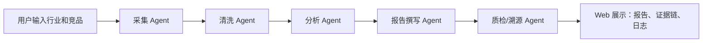

# 系统架构

## 数据流

1. 用户输入行业和竞品列表。
2. 采集 Agent 可选择先进行真实网页搜索、抓取和正文抽取；若网络失败或无结果，则从演示公开信息库匹配来源。
3. 清洗 Agent 去重并规范化证据结构。
4. 分析 Agent 基于证据生成竞品画像和横向洞察。
5. 报告 Agent 产出 Markdown 分析报告。
6. 质检 Agent 检查证据引用、低置信度来源和重复要点。
7. 系统将完整运行结果保存到 `runs/`，用于复盘和可观测性展示。

## 可扩展点

- 将当前 DuckDuckGo HTML 搜索扩展为多搜索源、队列化爬虫、robots 策略和更强正文抽取。
- 将规则分析替换为 LLM 调用，并保留同样的数据结构。
- 将 JSON 运行记录迁移到 SQLite 或 Postgres。
- 将线性 DAG 扩展为并行采集、多轮审核和人工确认。
